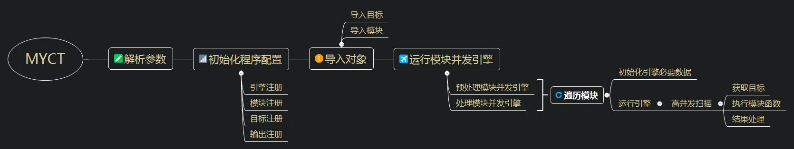

# MyCT(My *Concurrent Toolkit*)  

[](https://www.python.org/) [](docx/LICENSE.txt) 
基于**Xyntax的[POC-T](https://github.com/Xyntax/POC-T)** 进行个人重构。
用于安全运维中的批量PoC、子域发现与端口扫描等并发任务。


声明
---
本工具仅用于个人安全研究学习。由于传播、利用本工具而造成的任何直接或者间接的后果及损失，均由使用者本人负责，工具作者不为此承担任何责任。


程序架构
---



特点
---
- 高并发（线程或协程）
- 支持多模块、双步骤执行
- 模块编写快捷方便


安装
---
* 安装 python2.7、pip
* 安装依赖库：`pip install -r requirement.txt`


快速开始
---
* 帮助：`python MyCT.py -h`
* 显示模块：`python MyCT.py --show`
* 使用**模块1**处理并发目标：`python MyCT.py -m 模块1 -iN 1.1.1.0/24`
* 使用**模块1**预处理并发目标，然后使用**模块2**对结果进行处理：`python MyCT.py -pm 模块1 -m 模块2 -iN 1.1.1.0/24`
eg：
* 子域名爆破：`python MyCT.py -m ljjsdb -c 500 -iS test.com`
* 扫描网段中的Web服务，获取网站标题、PoC测试：`python MyCT.py -pm get-web -m get-title struts2/S2-052 struts2/s2-057  -c 200 -iN 192.168.3.0/24`


模块编写
---
位于promodule/或premodule/下，新建py文件：
```
class c2Class(object):
	def __init__(self):
		pass	
	def c2Func(self,target):
		status = 0
		returnData = ''
		return status,returnData
```
其中：
- 类名`c2Class`、方法名`c2Func`，一般不可以改变，必须使用该名称定义类与方法。
- `c2Class`的 `__init__`方法一般放置一些通数据，如漏洞名称等。
- `c2Class`的 `__init__`方法一般放置需要并发的代码（PoC逻辑、端口扫描等）。
- 返回**状态码**、**返回数据**：
  - 状态码为int型，有4种：0-失败、1-成功、-1-重试、10-成功且重试。
  - 返回数据可以是任意类型（必须实现了**`__str__`方法**，如果需要设置目标优先级，还需要实现**`__lt__`方法**），也可以是list类型，list元素需符合以上要求。

更多详情可查看premodules或pocmodules目录下的`demo.py`。


程序设置
---
lib/core/setting.py 下
并发数 **CONCURRENT_NUM**  默认为 50
并发模块类名称 **CLASSNAME** 默认为 c2Class
并发模块类的并发函数名称 **FUNCNAME **默认为 c2Func


反馈
---
Mail：h.vi@qq.com
或者[issue](https://github.com/0671/MyCT/issues/new)、PR
